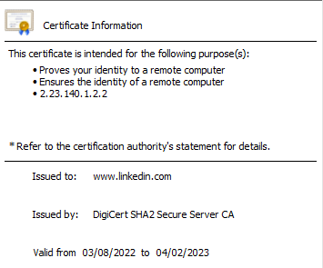

## Einführung

Zuerst eine kurze Erklärung für alle, die nicht so technisch unterwegs sind. Fast jeder nutzt täglich Zertifikate. Auch wenn die allermeisten sich dessen gar nicht bewusst sind. Aber jeder Aufruf der Google Internetseite ist mittlerweile per TLS verschlüsselt, erkennbar am https:// in der Adresszeile. Das gilt heutzutage für fast alle Internetseiten. Aber auch außerhalb des World Wide Web werden Zertifikate häufig eingesetzt.

## Vorteile von Zertifikaten
Ich als Benutzer solcher mit TLS abgesicherten Seiten habe einige Vorteile. Der Datenkanal zwischen mir und dem Server auf dem die Seite liegt ist verschlüsselt. Es kann also niemand Drittes die Daten lesen. (Zumindest so lange der private Schlüssel des Seitenanbieters geheim bleibt). Außerdem kann ich sicher sein, dass ich auch wirklich mit Google kommuniziere und nicht mit jemanden der das nur vogibt.

## Beispiel
Wie wird das gelöst? Na logisch, mit Zertifikaten. Hier mal ein Ausschnitt des LinkedIn Zertifikats.

